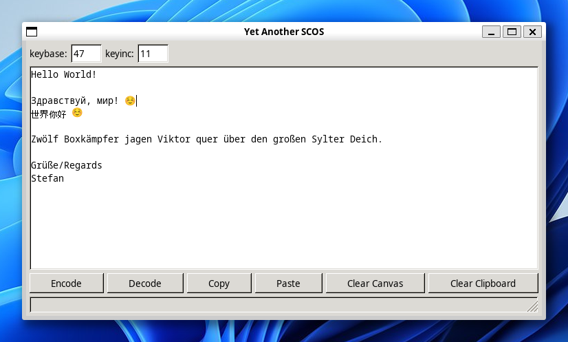

# yas
yas - Yet Another SCOS

Richard Heathfield, from the Usenet Group sci.crypt, introduced  
his SCOS (sci.crypt open secret) a while ago to the community.  

This is an enhanced version of SCOS, using base64.

Allowed numbers for keybase and keyinc must be between 0 and 63.

Decoding is done automatically, without providing keybase and keyinc.
```
Compiling for Linux:  
$ gcc -o yas linux_app.c core_logic.c `pkg-config --cflags --libs gtk+-2.0`

Compiling for Windows:  
$ x86_64-w64-mingw32-gcc -o yas.exe windows_app.c core_logic.c manifest.res \
     -mwindows -municode \
     -lcomctl32 -lriched20 -limm32 -lgdiplus -lole32 -luuid \
     -I/usr/share/mingw-w64/include \
     -L/usr/lib/gcc/x86_64-w64-mingw32/posix
```

# encode

# decode

